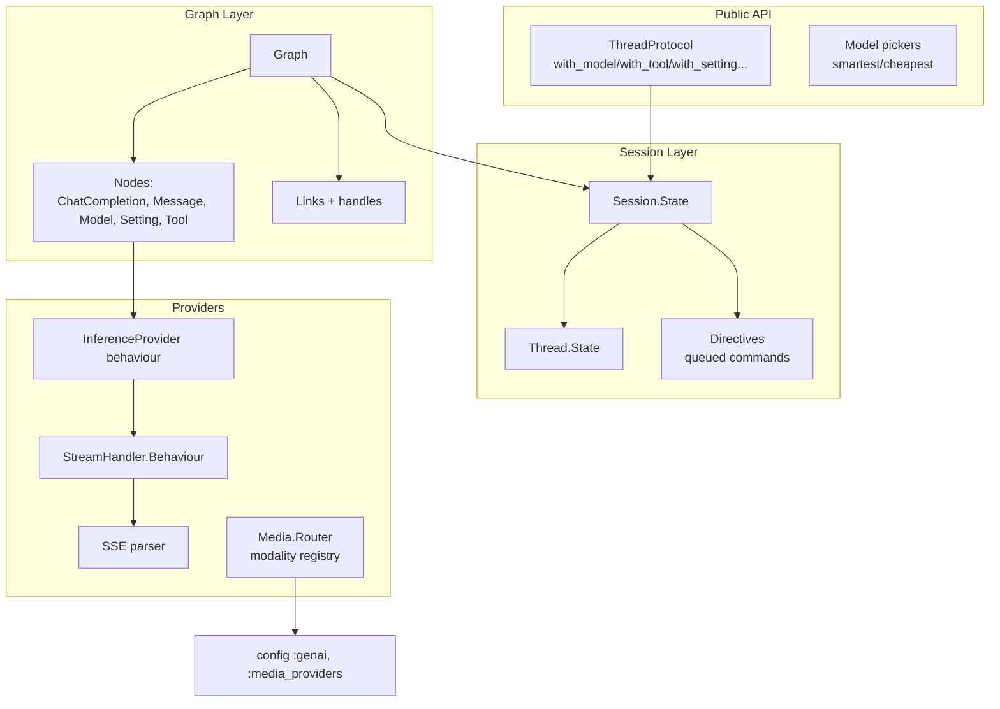

# Project Architecture

## Overview

`genai_core` is a pure Elixir library providing the base protocols and structures for
generative-AI applications: model/session/dialogue abstraction, graph-based prompt
construction, inference-provider routing, streaming (SSE), media generation, and tool
chaining. It ships no infrastructure of its own — consuming applications (most Noizu
Elixir AI apps) embed it and supply provider credentials.

The defining architectural pattern is **branch by abstraction**: a legacy
`Genai.*` namespace and a redesigned `VnextGenai.*` namespace coexist, with legacy
modules delegating to or being progressively replaced by vnext structures. All new
work targets vnext; legacy shims (`legacy.node_protocol.ex`,
`legacy_state_protocol.ex`) keep old callers working during migration.

## System Diagram

## Core Components

| Component | Purpose |
|-----------|---------|
| Thread/Session | `ThreadProtocol` (model/tool/setting/api-key builders) over immutable `Session.State` with directive replay |
| Graph | Nodes + links forming prompt/computation graphs; `NodeBehaviour` + `defnodetype` macro; Mermaid rendering protocol |
| Nodes | Chat completion, message (+content types), model refs, settings, tool schemas |
| Records | Erlang-record process signals (`process_next/end/yield/error`) and handle resolution |
| Stream handling | Provider SSE normalization (Anthropic, OpenAI) behind a common behaviour |
| Media | Modality-based routing to registered providers (`supported_modalities/0`) |
| Tooling | Tool registry + JSON-schema builders + tool-chain loop state |
| Model metadata | Model details (limits, pricing, capabilities) for pickers |

→ *Components ↔ directories: see [PROJ-LAYOUT.md](PROJ-LAYOUT.md) → [layout/lib.md](layout/lib.md)*

## Key Design Decisions

- **Branch by abstraction (vnext)**: isolate core functionality so extensibility does
  not break legacy consumers (`lib/genai` vs `lib/vnext_genai`).
- **Protocols over structs**: `ThreadProtocol`, `NodeProtocol`, `MermaidProtocol`,
  `DirectiveBehaviour`, provider/stream behaviours — implementations plug in without
  library changes.
- **Immutable state with directive replay**: sessions queue directives with a
  position cursor; state is rebuilt deterministically, enabling undo/branching.
- **Explicit media registry (ADR-016 D4)**: providers declare modalities; the router
  never hardcodes capability sets. Registry via `config :genai, :media_providers`.
- **Pure incremental SSE parsing**: `feed/2` carries partial frames across chunks;
  provider handlers normalize to common events.
- **Model pickers**: `Model.smartest()`/`Model.cheapest()` select at inference time
  from model metadata, rather than hardcoding a model id.

## Technology Stack

Elixir 1.19 / OTP 28 · Finch (HTTP) · Jason · Floki · noizu_labs_core · ExDoc/Dialyxir (dev) · ExUnit CI (`.github/workflows/elixir.yml`).

## References

- Data model detail: [PROJ-SCHEMA.md](PROJ-SCHEMA.md)
- Repo layout: [PROJ-LAYOUT.md](PROJ-LAYOUT.md)
- Monorepo coupling: trl-infra `docs/SUBS.md` (sibling packages: `ai/genai`, `ai/genai-approval`, `ai/ex_llama`)
