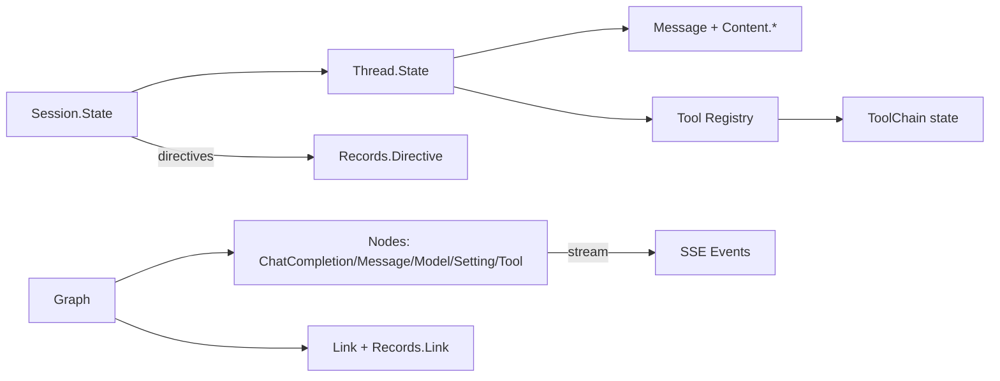

# Project Schema

`genai_core` is a **pure Elixir library with no relational store** (no Ecto schemas,
no Liquibase changelogs). The "schema" of this repo is its in-memory data model:
structs, Erlang records, config surface, and wire-interface shapes (SSE streams,
provider requests). Documented here per kind. Code organization: see
[PROJ-LAYOUT.md](PROJ-LAYOUT.md) and [layout/lib.md](layout/lib.md).

## 1. Core Structs (data model)

### GenAI.Thread.State — effective thread state

| Field | Type | Default | Description |
|-------|------|---------|-------------|
| model | list | `[]` | Active model stack |
| tools | map | `%{}` | Registered tools (id → tool) |
| settings | map | `%{}` | Effective combined settings |
| model_settings | map | `%{}` | Model-level settings |
| provider_settings | map | `%{}` | Provider-level settings |
| safety_settings | map | `%{}` | Safety settings |
| messages | list | `[]` | Message thread |
| artifacts | map | `%{}` | Generated artifacts |
| vsn | float | `1.0` | Structure version |

### GenAI.Session.State — session runtime state

| Field | Type | Default | Description |
|-------|------|---------|-------------|
| directives | list | `[]` | Queued directives (commands) |
| directive_position | non_neg_integer | `0` | Replay/cursor position |
| thread | list | `[]` | Thread element order |
| thread_messages | map | `%{}` | id → message |
| stack | map | `%{}` | Runtime stack frames |
| data_generators | map | `%{}` | Generators feeding state |
| options | map | `%{}` | Session options |
| settings / model_settings / provider_settings / safety_settings | map | `%{}` | Mirrors Thread.State |
| model | term | `nil` | Active model |
| tools | map | `%{}` | Tool registry state |
| monitors | map | `%{}` | Process monitors |
| artifacts | map | `%{}` | Session artifacts |

### Graph structures

| Struct | Module | Key fields |
|--------|--------|-----------|
| Graph | `GenAI.Graph` | `nodes`, links |
| Root | `GenAI.Graph.Root` | graph entrypoint handle |
| Link | `GenAI.Graph.Link` | edge: parent/child handles, settings |

### Message & content types (`GenAI.Message.Content.*`)

All content structs share `vsn` versioning.

| Struct | Fields | Notes |
|--------|--------|-------|
| TextContent | `system`, text | system role override |
| ImageContent / AudioContent | `source` | source: `{:file,path}` \| `:response` \| `{:uri,path}` |
| ThinkingContent | `thinking` | reasoning output |
| RedactedThinkingContent | `data` | opaque redacted reasoning |
| ToolUseContent | `id`, name, input | tool invocation request |
| ToolResultContent | `tool_name`, … | tool output |
| DocumentContent | blocks | composed of Text/Pdf/UrlPdfSource blocks |
| ToolCall | `id`, … | (message/tool_usage) |

### Chat completion results (`GenAI.Nodes.ChatCompletion.*`)

| Struct | Fields |
|--------|--------|
| Choice | `index`, message, finish_reason |
| Usage | `prompt_tokens`, completion_tokens, … |

### Tool schema types (`GenAI.Nodes.Tool.Schema.Type.*`)

JSON-Schema-shaped builders, one struct per type:
`Bool`, `Number` (`type: "number"`), `Object`, `Enum` (`type: "string"` + values),
`Integer`, `Null`, `String` — each carries `description` plus per-type constraints.

### Model details (`GenAI.Nodes.Model.Details.*`)

Metadata structs: rate limits (`tokens_per_minute`), pricing
(`million_input_tokens`), capabilities (`video`), `use_cases`, `benchmarks`,
release info — all versioned with `vsn`.

### Tool registry & results

| Struct | Fields |
|--------|--------|
| Registry.Entry | `name`, `source_id`, `source_name`, `module`, `source`, `tool`, `options` |
| Registry | `entries`, `sources`, `options` |
| Tool.Result | `call_id`, … |
| ToolChain (state) | `iterations`, `tool_calls`, `tool_errors`, `stop_reason` |

## 2. Erlang Records (`GenAI.Records.*`)

### Node process signals (`GenAI.Records.Node`)

| Record | Fields | Meaning |
|--------|--------|---------|
| `process_next` | element, session | continue to next element |
| `process_end` | element, session | terminate processing |
| `process_yield` | element, yield_for, session | pause awaiting external |
| `process_error` | element, error, session | abort with error |

### Link records (`GenAI.Records.Link`)

| Record | Fields | Meaning |
|--------|--------|---------|
| `graph_handle` | scope (`:standard`\|`:local`\|`:global`), name | named element reference; lookup order global → local → standard |
| `element_context` | element, link, container | node + inbound link + parent |

### Directive support entries (`GenAI.Records.Directive`)

Typed support descriptors for settings: `param_type` (`:float|\:int|\:bool|\:string|\:list|\:map`),
`param`, `as` (request alias), `sentinel` (validity lambda), `adjuster` (value rewrite),
plus range/constraint entries.

## 3. Config schema

- **Mix config** (`config/config.exs`): thin shell; imports `config/#{config_env()}.exs`
  (`dev.exs`, `test.exs`). No persisted config file.
- **Runtime config** (`GenAI.Config`): per-process or `:global` scoped
  get/set/reset of defaults (provider keys, endpoints) — no env-var schema of its own;
  values supplied by consuming apps.

## 4. Interface schemas (wire/data contracts)

### SSE stream events (`GenAI.StreamHandler.SSE`)

| Event | Shape | Meaning |
|-------|-------|---------|
| data frame | `{:data, payload}` | completed `data:` frame (multi-line joined with `\n`) |
| done | `:done` | OpenAI-compatible `[DONE]` sentinel |

Comments (`:` prefix) and non-`data` fields ignored; `\n\n` and `\r\n\r\n`
separators supported, including across chunk boundaries (incremental `feed/2`).
Per-provider normalization: `StreamHandler.Anthropic`, `StreamHandler.OpenAI`
(both implement `StreamHandler.Behaviour`).

### Struct relationships (Mermaid)

