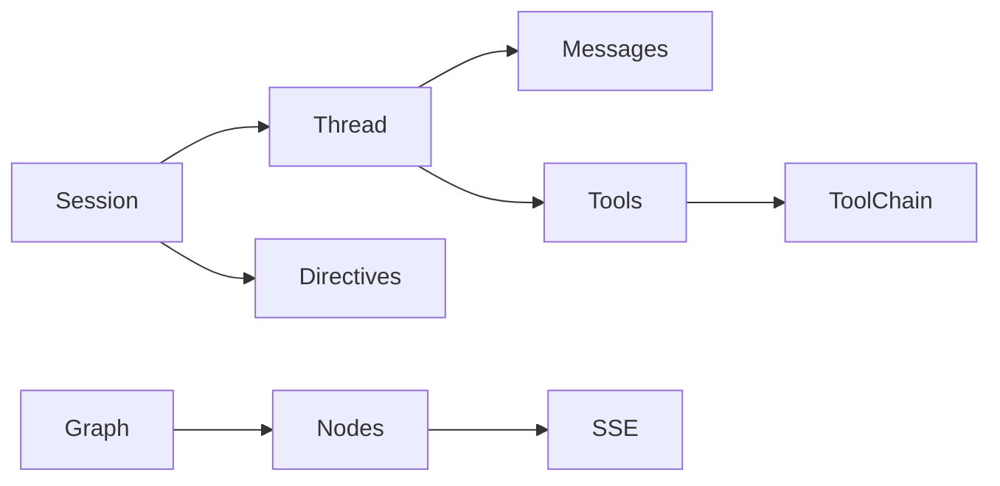

# Project Schema (Summary)

No relational store. Data model = Elixir structs + Erlang records + wire contracts.

| Kind | Core types |
|------|-----------|
| Thread/session state | `GenAI.Thread.State` (model/tools/settings/messages), `GenAI.Session.State` (directives, thread, monitors, artifacts) |
| Graph | `GenAI.Graph`, `Root`, `Link` |
| Messages | `Content.*`: Text, Image, Audio, Thinking, RedactedThinking, ToolUse, ToolResult, Document(+Text/Pdf/UrlPdfSource) |
| Completion results | `Choice`, `Usage` |
| Tool schema | `Schema.Type.*` JSON-Schema builders (Bool/Number/Object/Enum/Integer/Null/String) |
| Model metadata | `Details.*` (limits, pricing, capabilities, benchmarks) |
| Tools | Registry(+Entry), `Tool.Result`, ToolChain state |
| Records | `process_next/end/yield/error` signals; `graph_handle`, `element_context`; directive support entries |
| Config | Mix env-config split; `GenAI.Config` global/per-process |
| Wire | SSE `{:data, payload}` / `:done`; Anthropic/OpenAI handlers via `StreamHandler.Behaviour` |

