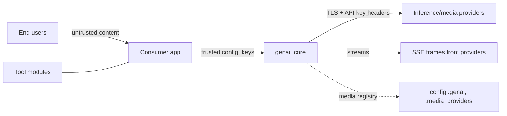

# Threat Model

## Overview

`genai_core` is a **library, not a deployed service** — it has no ingress, no own
infrastructure, and no data stores. Its security posture is therefore *consumer-facing*:
the crown jewels are (1) provider API keys/orgs that flow through session state and
outbound request headers, and (2) prompt/message content, which commonly carries
user PII and proprietary context. The library executes inside the consuming
application's trust domain and makes credentialed egress calls to inference/media
providers on its behalf.

Grounding: components and data flows in [PROJ-ARCH.md](PROJ-ARCH.md); implementing
directories in [PROJ-LAYOUT.md](PROJ-LAYOUT.md).

## Trust Boundaries

1. **Consumer app ↔ library**: settings, messages, and tool modules are supplied by
   the consuming app (trusted config), but message/tool-result *content* often
   originates from end users or model output (untrusted data in trusted channels).
2. **Library ↔ external providers**: credentialed egress via Finch
   (`GenAI.Finch`) to inference and media APIs — TLS assumed, endpoints set via
   provider settings.
3. **Config ↔ runtime**: media provider registry and any endpoint overrides arrive
   via Mix config — trusted by definition, but a mis-scoped config value widens the
   egress surface.

## Attack Surface

## Vulnerability Register

| ID | Severity | STRIDE | Component | Status |
|----|----------|--------|-----------|--------|
| T-001 | High | Info disclosure | API keys held in `Session.State` provider settings — inspectable/loggable, persist for session lifetime | Partial (consumer must avoid logging/serializing state) |
| T-002 | Medium | Spoofing/Tampering | Egress URLs derived from provider settings; a poisoned setting redirects keys to attacker host | Open (accepted: settings are app-controlled) |
| T-003 | High | Tampering/EoP | Prompt injection via message + tool-result content; library passes through unfiltered and tool execution is consumer-side | Documented (consumer responsibility) |
| T-004 | Low | DoS | SSE `feed/2` buffers unbounded partial frames; hostile/compromised provider can grow memory | Accepted (provider is semi-trusted) |
| T-005 | Medium | Info disclosure/SSRF | Image/audio/document sources `{:uri, path}` can point at internal endpoints if shaped from untrusted input | Open (consumer responsibility) |
| T-006 | Medium | Supply chain | Hex deps (Finch, Jason, Floki) enter every consumer build | Mitigated (mix.lock pinning, optional deps) |
| T-007 | Low | Info disclosure | `Logger` used in session paths; accidental state inspection could emit keys | Partial |
| T-008 | Low | EoP | Tool registry invokes consumer-configured modules — arbitrary code by design | Accepted (config is trusted) |

## Mitigation Coverage

0 mitigated · 3 partial/documented · 3 accepted · 2 open-with-owner (T-002, T-005 —
both require consumer-side input validation; guidance belongs in README/CONTRIBUTING).

## Residual Risk

As a library, genai_core deliberately accepts that it cannot control how consumers
log session state (T-001/T-007) or validate content provenance (T-003/T-005). The
residual risk is bounded by the consuming app's own controls; this document is the
checklist a consumer should audit against when embedding the library.

## References

- Architecture: [PROJ-ARCH.md](PROJ-ARCH.md) · Data model: [PROJ-SCHEMA.md](PROJ-SCHEMA.md)
- Monorepo security conventions: trl-infra `docs/secret-management.md`
